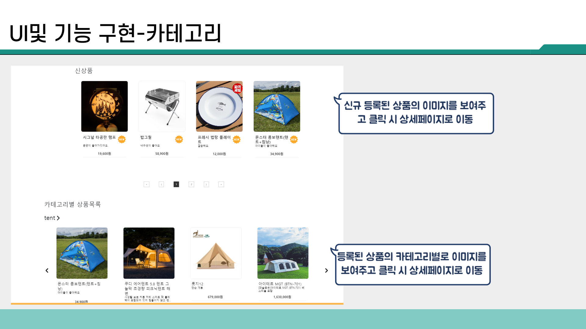

# :pushpin: camply
>통합 캠핑 플랫폼 웹 사이트  

 

## 1. 제작 기간 & 참여 인원
- 2024년 1월 15일 ~ 2월 14일
- 5인 팀프로젝트

 

## 2. 사용 기술
### 백엔드
#### Server
* JAVA 17
* Spring
* Spring Boot
* MyBatis

#### Build tool
* Maven

#### Database
* Oracle
* Redis

### 프론트엔드
* React
* BootStrap

#### AWS
* EC2
* RDS
* Route 53
* Certificate Manager

 

## 3. 아키텍쳐

## 4. ERD

## 5. 화면구현 시안

## 6. [시연 영상](https://youtu.be/gsUSwgsf8Ao)

## 7. 담당 기능

<b>기능 설명 펼치기</b>

### 7.1. 메인페이지
 
- **com.camply.shop.main** :pushpin: [코드 확인](https://github.com/chanakoh/camply/blob/master/Server/src/main/java/com/camply/shop/main/controller/MainController.java)
  - 메인페이지에서 ID값 기준으로 썸네일 노출
  - Like문을 이용한 상품 검색.
  - 카테고리를 기준으로 썸네일 노출 
### 7.2. 카테고리페이지
 
- **com.camply.shop.category** :pushpin: [코드 확인](https://github.com/chanakoh/camply/blob/master/Server/src/main/java/com/camply/shop/category/controller/CategoryController.java)
  - 카테고리 페이지에서 카테고리 기준으로 모든 상품 썸네일 노출 
### 7.3. 상품 상세페이지
 
- **com.camply.shop.productdetail** :pushpin: [코드 확인](https://github.com/chanakoh/camply/blob/master/Server/src/main/java/com/camply/shop/productdetail/controller/ProductDetailController.java)
  - 상품id기준으로 DB에 있는 모든값 가져오기 
### 7.4. 상품 리뷰페이지
 
 
- **com.camply.shop.productdetail.review/reviewcomment** :pushpin: [코드 확인](https://github.com/chanakoh/camply/blob/master/Server/src/main/java/com/camply/shop/productdetail/controller/ProductDetailController.java)
  - productId값을 기준으로 전체 후기 가져오기
  - 수정 시 가져올 수 있도록 후기 가져오기
  - 후기 작성/수정/삭제
  - 후기 댓글 조회/작성 
### 7.5. 장바구니 페이지
 
- **com.camply.shop.cart** :pushpin: [코드 확인](https://github.com/chanakoh/camply/blob/master/Server/src/main/java/com/camply/shop/cart/controller/CartController.java)
  - 장바구니 버튼 클릭 시 상품정보 가져오기
  - 작성한 장바구니 값 넣기
  - userid기준으로 등록한 내 장바구니 상품 보기
  - 내 장바구니 목록 삭제하기 
 ### 7.6. 결제 페이지
 
 
- **com.camply.shop.order** :pushpin: [코드 확인](https://github.com/chanakoh/camply/blob/master/Server/src/main/java/com/camply/shop/order/controller/OrderController.java)
  - 주문정보 저장 

 

## 8. 느낀점
처음 프로젝트 계획 단계에서는 팀원 5명 중 4명이 백엔드 개발을 담당하고 1명만이 프론트엔드를 맡기로 결정했습니다. 이러한 배분은 초기에는 타당해 보였으나, 실제 개발 과정에 들어가 보니 프론트엔드 담당자 한 명만으로는 모든 페이지의 구현이 현실적으로 불가능하다는 것을 깨달았습니다. 결국, 각 팀원은 자신이 담당하는 페이지에 대해 리액트를 이용한 프론트엔드 기능 개발까지 책임지게 되었습니다.

프로젝트를 진행하면서 또 다른 주요 깨달음은, 초기 회의에서 논의된 내용이 주로 백엔드 관련 사항에 초점을 맞추었다는 점입니다. 하지만 실제로 프로젝트를 진행해보니 리액트를 통한 프론트엔드 개발 작업이 전체 개발 일정의 약 70%를 차지할 정도로 큰 비중을 차지했습니다. 이는 프론트엔드 개발의 중요성과 시간 소요를 초기 계획 단계에서 충분히 인식하지 못했음을 반영합니다.

또한, 서버 측면에서 데이터베이스 처리에 소요되는 시간이나, 레디스를 활용한 임시 데이터 처리 기능과 같은 추가 개발이 필요한 부분에 대해서도 인식하게 되었습니다. 이러한 경험은 향후 개발 프로젝트를 계획하고 진행할 때 보다 균형 잡힌 시각을 갖고 접근하는 데 중요한 교훈이 되었습니다.

이 프로젝트를 통해 팀원 간의 협력과 각 분야의 중요성을 다시 한번 깨닫는 계기가 되었으며, 앞으로의 개발 프로젝트에 있어 이러한 경험이 소중한 자산이 될 것입니다.
